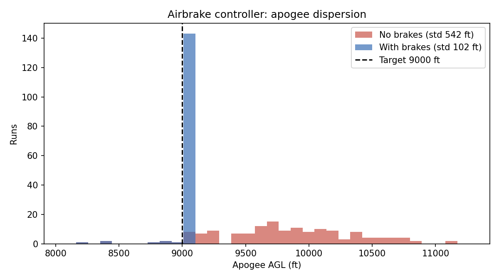

# Rocket Flight Simulator with Predictive Airbrake Control

[](https://github.com/DanialParviz/rocket-flight-sim/actions/workflows/ci.yml)

6-DOF trajectory simulation, Monte Carlo dispersion analysis, and a closed-loop
**predictive airbrake controller** for a generic high-power rocket. The 6-DOF
physics engine is [RocketPy](https://github.com/RocketPy-Team/RocketPy). The
controller, its forecast model, the dispersion framework, and the validation
tests are original work in this repo.

The vehicle is a **generic, illustrative model** (about 10,000 ft class). It uses
no proprietary data from any team or program.

## Headline result

Same 150 randomized flights, flown with and without the controller (target 9,000 ft AGL):

| | Mean apogee | Std dev | Mean abs error vs target |
|---|---|---|---|
| No brakes | 9,811 ft | 542 ft | 845 ft |
| **With brakes** | **9,000 ft** | **102 ft** | **34 ft** |

Closed-loop control cuts apogee scatter by **81%**. None of the 150 flights
overshot by more than 100 ft (137 did without brakes). Six flights fell short of the
target, because brakes can only remove altitude, never add it. See
[Limitations](#limitations).



## How the controller works

Every control step (10 Hz) during coast:

1. **Forecast:** a 2-D point-mass model (gravity, plus drag that depends on Mach
   number and brake deployment) integrates forward to predict apogee at the
   current deployment.
2. **Solve:** bisection on deployment in [0, 1] finds the level whose predicted
   apogee equals the target.
3. **Actuate:** the command passes through a slew-rate limit (0.5 per second) to
   mimic a real servo, then drives the brakes.

The forecast model uses **nominal** vehicle parameters, while each simulated
flight has randomized mass, drag, thrust, and wind. The controller is not told
about those errors. It corrects for them by re-forecasting every step.

## Validation and tests

```bash
pytest -v
```

| Test | What it checks |
|---|---|
| Vacuum limit | With drag removed, the predictor matches the analytic apogee `h + v²/2g` |
| Monotonicity | More deployment always lowers predicted apogee |
| Solver behavior | Hits the target; retracts when below it; saturates when unreachable |
| Atmosphere | ISA model matches sea-level density |
| **Predictor vs 6-DOF** | The fast forecast agrees with the full RocketPy apogee within 3% |
| Closed-loop | Controlled flight lands much closer to target than uncontrolled |

One thing validation caught: an early version of the simulation used a constant
300 K atmosphere, while the predictor used a standard atmosphere. The forecast
came out 4.5% low against the 6-DOF result, which the validation test flagged.
Switching the simulation to the standard atmosphere fixed it.

## Quick start

```bash
git clone https://github.com/DanialParviz/rocket-flight-sim.git
cd rocket-flight-sim
python -m venv .venv
source .venv/Scripts/activate   # Git Bash on Windows; .venv/bin/activate on Linux/macOS
pip install -r requirements.txt

cd src
python single_flight.py               # one nominal flight
python monte_carlo.py -n 300          # dispersion analysis (no brakes)
python airbrake_flight.py             # one flight, brakes off vs on
python airbrake_monte_carlo.py -n 150 # full comparison (a few minutes)
```

Options: `-n` runs, `-w` worker processes, `-o` output folder.

## Nominal flight (no brakes, 3 m/s wind)

| Metric | Value |
|---|---|
| Apogee (AGL) | about 9,940 ft |
| Max velocity | about 260 m/s |
| Rail exit speed | about 27 m/s |

## Monte Carlo inputs

| Parameter | Distribution |
|---|---|
| Wind speed | Normal, mean 4 m/s, std 2 m/s |
| Wind direction | Uniform, 0 to 360 degrees |
| Rail inclination | Normal, mean 85 degrees, std 1 degree |
| Motor thrust | Normal, mean 1.0x, std 3% |
| Drag coefficient | Normal, mean 1.0x, std 5% |
| Dry mass | Normal, mean 19 kg, std 0.3 kg |


## Project layout

```
src/
  rocket_model.py           environment, motor, rocket definitions
  airbrakes.py              apogee predictor, bisection solver, controller
  single_flight.py          nominal flight and key metrics
  monte_carlo.py            parallel dispersion analysis
  airbrake_flight.py        single flight, brakes off vs on
  airbrake_monte_carlo.py   paired Monte Carlo comparison
tests/                      unit and integration tests (pytest)
results/                    generated figures and summaries
.github/workflows/ci.yml    tests on every push (Python 3.11 and 3.12)
```

## Limitations

- **Generic vehicle.** Mass, drag, and thrust are illustrative, not from a real rocket.
- **Brakes only remove altitude.** If a flight is already predicted to fall below
  the target, the controller can only retract. Choose a target with margin below
  the uncontrolled apogee.
- **Idealized actuator and sensing.** The controller sees exact state (no sensor
  noise, latency, or filtering) and the brakes follow a simple linear drag model.
- **Simple forecast model.** A 2-D point mass ignores wind in the forecast and
  assumes constant mass during coast.
- **Constant-wind atmosphere.** No real soundings or wind shear.

## Roadmap

- [ ] Sensor noise and a Kalman filter in the loop
- [ ] Actuator latency and deployment-dependent drag from CFD
- [ ] Real atmospheric soundings
- [ ] Trajectory and deployment-vs-time plots for the nominal flight

## License

MIT
