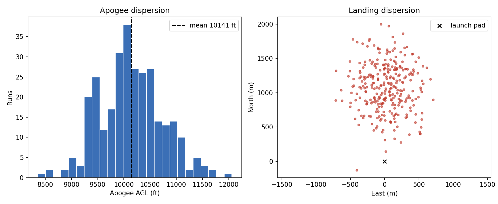

# Rocket Flight Simulator

6-DOF trajectory simulation and Monte Carlo dispersion analysis for a generic
high-power rocket, built with [RocketPy](https://github.com/RocketPy-Team/RocketPy).

The vehicle in this repo is a **generic, illustrative model** (about 10,000 ft
target apogee). It uses no proprietary data from any team or program.



## What it does

- **Nominal flight:** 6-DOF simulation reporting apogee, max velocity, rail exit
  speed, and impact velocity
- **Monte Carlo dispersion:** randomizes wind speed and direction, rail angle,
  motor thrust, drag coefficient, and vehicle mass, then reports apogee
  statistics and landing scatter
- **Parallel execution:** runs are distributed across CPU cores with
  `multiprocessing`

## Quick start

```bash
git clone https://github.com/DanialParviz/rocket-flight-sim.git
cd rocket-flight-sim
python -m venv .venv
source .venv/Scripts/activate   # Git Bash on Windows; use .venv/bin/activate on Linux/macOS
pip install -r requirements.txt

cd src
python single_flight.py         # one nominal flight
python monte_carlo.py -n 300    # 300-run dispersion analysis
```

Monte Carlo options: `-n` number of runs, `-w` worker processes, `-o` output folder.

## Nominal flight

| Metric | Value |
|---|---|
| Apogee (AGL) | about 10,200 ft |
| Max velocity | about 260 m/s |
| Rail exit speed | about 27 m/s |

## Monte Carlo inputs

| Parameter | Distribution |
|---|---|
| Wind speed | Normal, mean 4 m/s, std 2 m/s |
| Wind direction | Uniform, 0 to 360 degrees |
| Rail inclination | Normal, mean 85 degrees, std 1 degree |
| Motor thrust | Normal, mean 1.0x, std 3% |
| Drag coefficient | Normal, mean 1.0x, std 5% |
| Dry mass | Normal, mean 19 kg, std 0.3 kg |

## Project layout

```
src/
  rocket_model.py     environment, motor, and rocket definitions
  single_flight.py    nominal flight and key metrics
  monte_carlo.py      parallel dispersion analysis and plots
results/              generated figures
```

## Roadmap

- [ ] Active airbrake model with a backwards-physics deployment solver
- [ ] CFD-derived drag lookup tables
- [ ] Real atmospheric soundings instead of a constant-wind model
- [ ] Trajectory and velocity plots for the nominal flight

## Notes

Results depend on the generic parameters in `rocket_model.py`. Swap in your own
vehicle's mass properties, drag curve, and thrust data to model a specific rocket.

## License

MIT
